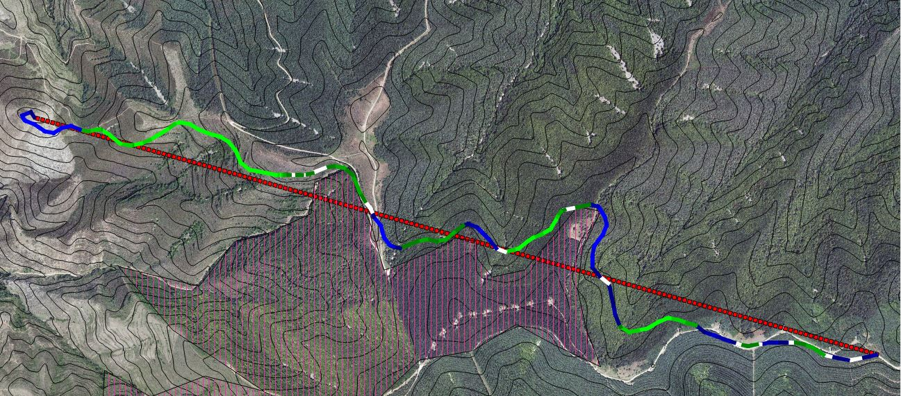
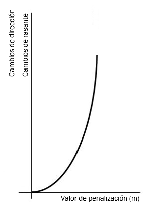
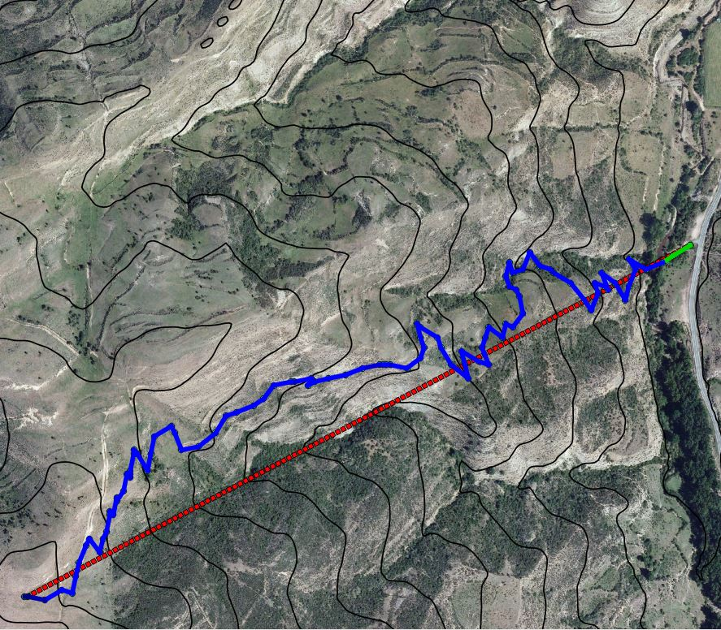
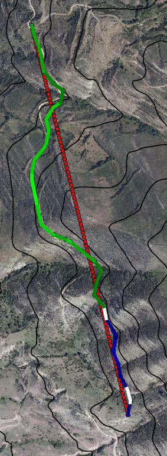
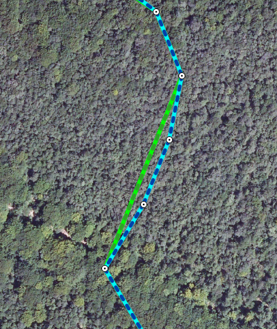
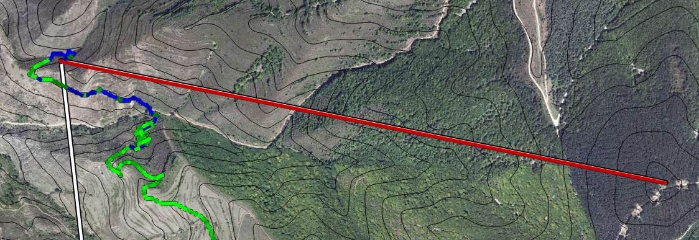

# Manual de usuario de FOREST ROAD DESIGNER V1.2

***Complemento QGIS para el diseño y planificación de vías forestales***

Contacto: ***Dirección General de Tecnologías de la Información y la Comunicación - Gobierno de La Rioja (Spain)***
e-mail: *dgagendadigital@larioja.org*

**HISTORIAL DE CAMBIOS**
 - V1.2 (26/02/2018): Actualización GUI, capas de salida, lanzamiento del proceso
 

***1. DESCRIPCIÓN Y UTILIDAD***

*Forest Road Designer* (FRD) es un complemento desarrollado en entorno
Python para su utilización en el Software QGIS (http://qgis.org/es/site/index.html) (operativo desde la
versión 2.14.), cuyo objetivo es servir de apoyo a técnicos y gestores
en la fase inicial del diseño y planificación de vías forestales.
*Forest Road Designer* es una herramienta desarrollada por PANOimagen
S.L. por demanda de la Dirección General de Medio Natural del Gobierno
de La Rioja y financiada por la Dirección General de Tecnologías de la
Información y la Comunicación.

La idea original de *Forest Road Designer* parte de la extensión
Peger (http://www.ruraltech.org/tools/pegger/) para ESRI Arcview, y su desarrollo viene motivado de la
necesidad de tener una herramienta libre, que sirva a los gestores y
técnicos como apoyo a la hora de diseñar y planificar vías forestales,
de forma rápida y sencilla. La herramienta trabaja sobre modelos
digitales del terreno (MDT o DTM) lo que supone un importante avance
respecto a Pegger, en lo que a resolución del resultado se refiere, dado
que se analiza el terreno punto a punto, dejando de lado las curvas de
nivel.

*Forest Road Designer* genera en su proceso dos capas de tipo vectorial
(“*ESRI Shapefile*”), una de tipo punto (generada como capa vectorial en
memoria), que contiene los puntos con la ruta óptima de la vía diseñada,
y otra de tipo polilínea que contiene dicha ruta (guardada en disco),
pero de forma simplificada.

La capa de tipo punto con la ruta óptima debe ser guardada por el
usuario ya que se genera como capa de memoria, sin embargo, la capa de
tipo polilínea con la ruta simplificada se guarda automáticamente en
disco.

El complemento *Forest Road Designer* no viene integrado en QGIS por
defecto, es necesario instalarlo desde el repositorio de complementos de
QGIS, una vez instalado, aparecerá el icono correspondiente en la barra
de herramientas de la interfaz de QGIS, desde el cual, podremos empezar
a usarlo. Además, dentro del menú Complementos de la barra de
herramientas de QGIS podemos acceder a un menú sobre el plugin.

Este complemento lleva integrado un algoritmo de optimización, que
busca, de entre todas las posibles soluciones para ir de un punto a otro
del terreno, la mejor de ellas, atendiendo a minimizar la distancia
recorrida y cumpliendo a su vez una serie de especificaciones dadas por
el usuario (pendiente máxima y mínima admisible para el trazado).

El complemento presenta una interfaz de usuario muy sencilla e intuitiva
(Imagen 1), en la cuál es necesario especificar una serie de capas y
parámetros de diseño, que se van a explicar más adelante.

La interfaz del plugin *Forest Road Designer* está diseñada para una
resolución mínima de pantalla de 1024 x 768, por debajo de esta, es
posible que no aparezcan todos los elementos de la misma. Con
resoluciones superiores a la indicada podremos ver completamente la
interfaz del plugin.

**Imagen 1.** Aspecto de la interfaz gráfica del complemento *Forest Road Designer*

**Descripción de los objetos de la interfaz:**

**I.**  Desplegable para especificar la capa ráster del modelo digital del
    terreno (MDT)

**II.** Casilla para activar la opción de diseño con áreas de exclusión

**III.** Desplegable para especificar la capa vectorial con las áreas de
     exclusión para el diseño del trazado. Esta capa debe tener formato
     “*ESRI Shapefile*” de tipo polígono o multipolígono

**IV.** Directorio donde se guardarán los resultados del diseño

**V.**  Botón para abrir el explorador y especificar el directorio donde se
    guardarán los resultados del diseño

**VI.** Casilla para especificar el valor mínimo de pendiente admisible para
    el trazado

**VII.** Casilla para especificar el valor máximo de pendiente admisible
    para el trazado

**VIII.** Casilla para especificar el tamaño de la vecindad para el área de
    búsqueda (en píxeles). A la izquierda de la casilla se muestra una
    traducción del valor del área de búsqueda en píxeles traducido a
    metros

**IX.** Casilla para especificar el valor de la penalización por cambios de
    dirección

**X.**  Casilla para especificar el valor de la penalización por cambios de
    rasante

**XI.** Casilla para especificar el factor de tolerancia para la
    simplificación de la polilínea de resultado. A la izquierda de
    esta casilla se muestra la equivalencia del factor especificado en
    la casilla correspondiente en metros^2

**XII.** Casilla para activar el modo de proceso por lotes o automático. Se
     activará *XIII*

**XIII.** Desplegable para especificar la capa que contiene los puntos de
      ruta para el diseño (punto inicial, punto final y puntos de paso
      intermedios). La capa debe ser vectorial con formato “*ESRI
      Shapefile*” de tipo polilínea

**XIV.** Botón para comenzar el diseño en el modo por lotes o modo
     automático, en función de lo marcado en *XII*

**XV.** Botón para finalizar el diseño en modo interactivo

***2. FUNCIONAMIENTO***

Este complemento admite distintos modos de utilización, un modo en el
que el usuario asiste el diseño mediante la adición/eliminación de
tramos, y otro modo o proceso por lotes, en el cuál el usuario
únicamente especifica el punto de inicio, final y los puntos intermedios
de paso, siendo estos últimos opcionales.

Para ambos modos o procesos existe la posibilidad de habilitar la opción
en la cual, la herramienta admite como entrada una capa vectorial de
tipo polígono (formato “ESRI Shapefile”) con áreas a excluir del diseño
del trazado (ver *II* y *III*. Imagen 1). De esta forma es posible el
diseño del trazado limitando su paso por determinadas áreas (cauces,
zonas inundables, zonas húmedas, áreas de interés especial por diversos
factores, …).

-   ****PROCESO INTERACTIVO****

    En este modo el usuario va asistiendo el diseño del trazado, mediante
    la adición/eliminación de tramos con el ratón, indicando la dirección
    y/o el punto de llegada del tramo/tramos correspondientes.

    Antes de empezar el diseño es necesario ajustar los parámetros, una
    vez hecho esto, para empezar el diseño de forma interactiva es
    necesario que la casilla correspondiente esté desactivada (ver *XII*.
    Imagen 1), entonces se debe hacer click en Iniciar el proceso de
    diseño (ver *XIV*. Imagen 1). Cuando se pulsa en Iniciar el proceso de
    diseño, el cursor del ratón cambia a una cruceta y podemos fijar el
    primer punto del trazado haciendo click con el botón izquierdo del
    ratón donde se desee. A partir de aquí se van añadiendo o eliminando
    tramos a gusto del usuario.

   -   *Click ratón izquierdo:* Inicio del diseño y avanzar (añadir tramos)

   -   *Click ratón derecho:* función para borrar el último tramo creado

  Una vez se ha terminado el diseño se puede cerrar la edición, para
  ello debemos hacer click en Finalizar captura > simplificación
  polilínea (ver *XV*. Imagen 1) y se crearán entonces los archivos de
  salida con el trazado. Por un lado, la capa en memoria de tipo punto
  con la ruta óptima y por otro la capa almacenada en disco de tipo
  polilínea con la ruta simplificada.

-   ****PROCESO POR LOTES****

    En este modo, es necesario también fijar los parámetros de diseño, y
    estando marcada la casilla correspondiente (ver *XII*. Imagen 1) se
    debe seleccionar la capa vectorial que contiene los puntos de inicio y
    final del trazado, así como opcionalmente puntos de paso intermedios.
    Dicha capa vectorial debe ser de tipo polilínea (formato “*ESRI
    Shapefile*”) y puede estar grabada en disco o ser un archivo en
    memoria.

    Para comenzar este proceso, una vez se han ajustado los parámetros y
    se han especificado las capas (modelo digital del terreno ráster,
    vectorial de puntos de ruta y vectorial con áreas de exclusión
    *\[opcional\]*) únicamente hay que hacer click en el botón Iniciar el
    proceso de diseño (ver *XIV*. Imagen 1).

    La aplicación va a generar como resultado dos capas vectoriales, una
    capa de tipo punto, que es el resultado bruto, donde los puntos indican
    la ruta óptima, y otra capa, de tipo polilínea que indica dicha ruta y
    que se cargan en la interfaz de QGIS una vez finaliza el proceso.

***3. EMPLEO DE FOREST ROAD DESIGNER***

***a. Datos de partida: Capas***

*Forest Road Designer* requiere de una serie de archivos o capas para
su funcionamiento:

- ***Modelo Digital del Terreno (MDT o DTM):***
MDT en formato ráster (GEOTiff/ascii) del que la aplicación sacará la información
altitudinal del terreno. Se recomienda el empleo de MDT con
resoluciones comprendidas entre los 5 y los 25 metros/pixel
(pudiéndose emplear MDT con resoluciones fuera del rango
anterior). La resolución de dicha capa tendrá influencia en el
resultado y en el tiempo de su obtención. El empleo de modelos
digitales del terreno con alta resolución puede ralentizar en
exceso el proceso.

  Es obligatorio que el modelo digital del terreno sea una capa
  almacenada en disco y su resolución vertical y horizontal debe ser
  similar, es decir, la diferencia entre alto y ancho de los píxeles no
  debe ser mayor del 5 %.

- ***Polígono/s de exclusión*** *\[opcional\]*:
*Forest Road Designer* admite la posibilidad de excluir ciertas zonas 
del trazado, como ya se ha indicado previamente. Las zonas de exclusión 
deben estar definidas geográficamente mediante una capa vectorial (formato
“*ESRI shapefile*”) de tipo polígono o multipolígono. La
aplicación evitará el trazado por dentro de estas zonas (Imagen 2
e Imagen 3).

  Esta capa es necesario que esté almacenada en disco para que la
  función sea operativa.

 

**Imagen 2.** Trazado de vía sin incluir áreas de exclusión al trazado

 

**Imagen 3.** Trazado de vía incluyendo áreas de exclusión. La aplicación traza la vía 
evitando entrar en el área rallada verticalmente

- ***Puntos de ruta o de paso***: 
Solo para el modo automático. Esta capa, con formato “*ESRI Shapefile*” 
de tipo polilínea debe tener al menos un segmento, que indica el punto 
de salida y de llegada, pudiendo tener más de un segmento siendo los 
puntos intermedios puntos de paso obligados para el trazado que se quiere 
diseñar. Aunque la capa de los puntos de ruta de tipo polilínea presente
más de un segmento, es decir, más de 2 puntos, es obligatorio que
esta capa presente solamente un único elemento (“*feature*”).

  Esta capa puede ser tanto una capa en memoria como una capa almacenada en disco.

***b. Datos de partida: Parámetros de diseño***

El complemento requiere de una serie de parámetros, que tendrán
influencia en el resultado obtenido y que es necesario ajustar, no
obstante, al abrir la aplicación, se cargan unos valores por defecto.
Se dan recomendaciones de los valores de los distintos parámetros, que
no deben asumirse como reglas fijas dado que cada trazado y cada zona
de terreno va a tener sus particularidades, por lo tanto también sus
parámetros ideales.

- ***Pendiente máxima:***
Pendiente máxima admisible para el diseño del trazado. El valor de la
pendiente se especifica en porcentaje (metros verticales / 100 metros
horizontales). A la izquierda de la casilla correspondiente aparece el
equivalente en grados sexagesimales.

- *Valor recomendado:* en función de la vía a diseñar y de las características del terreno (10 - 15 %)

- ***Pendiente mínima:***
Pendiente mínima admisible para el diseño del trazado. El valor de la
pendiente mínima se puede anular especificando el valor 0.0 en la
casilla correspondiente. El valor de la pendiente se especifica en
porcentaje (metros verticales / 100 metros horizontales). A la
izquierda de la casilla correspondiente aparece el equivalente en
grados sexagesimales.

- *Valor recomendado:* en función de la vía a diseñar y de las características del terreno (< 2 %)

- ***Tamaño de vecindad:***
Este parámetro interviene en el área de búsqueda de la aplicación
sobre el modelo digital del terreno (MDT), es decir, el tamaño de la
rejilla ráster que inspecciona el algoritmo de búsqueda. La aplicación
desde el punto de origen, o desde un punto intermedio del trazado,
analiza las posibles rutas a seguir en un área vecina con un tamaño
*\[(2 · c + 1) · r x (2 · c + 1) · r\]*, siendo “*c*” el tamaño de
vecindad especificado en la casilla correspondiente (ver *VIII*.
Imagen 1) y “*r*” la resolución espacial del modelo digital del
terreno en metros/pixel.

    Este parámetro influye significativamente en el resultado obtenido,
    así como en el tiempo de procesado. La herramienta va analizando las
    zonas en las que puede moverse, cumpliendo con las limitaciones de
    pendiente y de ellas se selecciona la que menor distancia recorrida
    presenta, así sucesivamente hasta completar la ruta.

    En la imagen siguiente (Imagen 4) se muestra a modo de ejemplo el
    funcionamiento de este parámetro de diseño. El punto rojo sobre el
    cuadro oscuro muestra la posición actual, siendo el resto de cuadros o
    celdas los puntos a analizar o zonas de búsqueda, de los que se
    seleccionan los puntos candidatos (que cumplen las especificaciones
    del diseño).

    La aplicación seleccionará el cuadro o celda, que cumpliendo con las
    especificaciones del diseño (pendientes máximas y mínimas) presente la
    menor distancia al actual (cuadro central). El ancho y alto del
    esquema siguiente indican el número de píxeles del modelo digital del
    terreno sobre los que se hace la búsqueda. De acuerdo con lo
    presentado anteriormente el área de búsqueda se obtiene mediante *\[(2
    · c + 1) · r x (2 · c + 1) · r\]*, siendo el caso presentado (Imagen
    4) con un tamaño de vecindad *c = 2*.

**Imagen 4**. Esquema de la estructura de un ráster y del tamaño de vecindad 
en la búsqueda de la ruta óptima. Vecindad (c) = 2

  Por ello, en caso de especificar una vecindad de 2 píxeles vecinos,
  para un modelo digital del terreno (MDT) de 10 metros/pixel de
  resolución, tenemos un área de búsqueda de:

  ***[(2 · 2 + 1) · 10 x (2 · 2 + 1) · 10] = 50 x 50 metros***

  Nótese, que valores muy bajos de vecindad limitan mucho el movimiento,
  dado que la zona explorada es menor, sin embargo, el trazado de la vía
  se acerca con mayor detalle a las características del terreno, como se
  aprecia en las imágenes siguientes (Imagen 5 e Imagen 6), frente a
  mayores valores del tamaño de vecindad, para lo que el terreno
  explorado es mayor, pero despreciándose y simplificándose las
  particularidades del terreno (Imagen 6). Valores muy bajos de vecindad
  pueden provocar también que no se encuentre una ruta óptima.

")

**Imagen 5.** Trazado resultante con tamaño de vecindad 3. MDT de 10 metros. [70 x 70] metros de área de
búsqueda

")

**Imagen 6.** Trazado resultante con tamaño de vecindad 15. MDT de 10 metros. [310 x 310] metros de área de
búsqueda

- *Valor recomendado:* en función del resultado que se desea obtener:

  - Para resultados que reflejen más fielmente la realidad del terreno
    valores bajos de vecindad (2 - 5)

  - Para zonas de orografía accidentada valores altos de vecindad
    (> 5)

  - Para trayectos cortos valores bajos de vecindad (2 - 5)

  - Para trayectos largos valores altos de vecindad (> 5)

    Téngase en cuenta también la resolución del modelo digital del terreno
    (MDT). Con MDT de resoluciones bajas (25 m/pixel) no conviene aumentar
    en exceso el tamaño de vecindad (máx. recomendado 15).

    Por último, señalar que es conveniente trabajar con MDT de calidad,
    dado que el empleo de MDT con malos filtrados de vegetación-suelo en
    el proceso de su elaboración no originan resultados aceptables.

- ***Penalización al cambio de dirección y al cambio de rasante:***
A continuación, se van a tratar los factores de penalización, por
cambio de dirección y por cambio de rasante, siendo éstos los
parámetros del diseño más complejos de entender en un primer momento,
pero que, una vez que se comprende su funcionamiento, probar con
distintos valores va a dar lugar a los resultados deseados.

    Se ha considerado la inclusión de estos dos factores de penalización
    en el proceso para poder modificar los trazados sin necesidad de
    modificar los puntos de ruta. Nos permiten además diseñar trazados con
    mayor criterio técnico. Antes de entrar en cada factor de
    penalización, se va a explicar el caso general.

    Las penalizaciones consideradas se manejan en metros, dado que es una
    magnitud fácil de entender en el diseño de vías y que la herramienta
    escoge el diseño que menor longitud presenta. Las penalizaciones
    siguen una distribución parabólica (Imagen 7), de forma que conforme
    nos vayamos acercando al caso extremo (giros de 180º, cambios de
    rasante de máx. pendiente en subida a máx. pendiente en bajada) más
    penalización se le va a asignar.

**Imagen 7.** Función parabólica empleada para cuantificar la penalización en metros (x) en función del valor
del parámetro a penalizar (y)

**El funcionamiento es el siguiente:**

  A la hora de seleccionar un trazado u otro de todos los posibles, si
  se le ha dado un valor de penalización de X metros, el trazado que
  presente la particularidad a penalizar, verá aumentada su longitud en
  función del valor de la particularidad y la distribución parabólica.
  Debido a esa penalización, que se contabiliza en metros, dicho trazado
  verá aumentada su longitud, por lo que será otro trazado el elegido
  pues la distancia recorrida será menor al no tener penalizaciones.

- ***Penalización por cambio de dirección:***
Este parámetro condiciona el número de curvas o cambios de dirección
del trazado. El parámetro alcanza el valor máximo de penalización para
curvas de 180º (cambios de dirección), por tanto, si el trazado
presenta un gran número de curvas cerradas, conforme se va aumentando
el valor de la penalización (en metros), el trazado ve aumentada su
longitud, por lo que se tenderá a diseñar un trazado con menor
presencia de curvas. Esto hace que un trazado con menos curvas, pero
con mayor longitud pueda ser el elegido, dado que se le aplican menos
penalizaciones.

    Gráficamente, se observa lo comentado en las imágenes siguientes,
    donde se ve, en primer lugar, un trazado diseñado con un valor de
    penalización de 0 metros por cambio de dirección, lo que origina un
    trazado excesivamente serpenteante con una consecución de curvas –
    contra curvas - tramos rectos excesivamente cortos no adecuada
    técnicamente y de corta longitud (Imagen 8).

**Imagen 8.** Trazado resultante para un factor de penalización de cambio de dirección de 0 metros.

  Al aumentar la penalización, por ejemplo, a 40 metros por cambio de
  dirección, el trazado resultante aplicando dicha penalización (Imagen
  9) presenta un menor número de curvas y una longitud total menor.

**Imagen 9.** Trazado resultante para un
factor de penalización de cambio de dirección de 40 metros.

  En resumen, a mayores valores de penalización por cambio de dirección
  obtendremos un trazado con menos cambios de dirección. Con valores de
  penalización de 0, obtenemos trazados con excesivas curvas y con
  tramos rectos entre curva y curva excesivamente cortos en la mayor
  parte de los casos.

- *Valor recomendado:* 
En función de la orografía y del trazado
buscado. Como valor general se puede tomar un valor de
penalización de 40 metros, aumentándose éste en zonas de orografía
accidentada y reduciéndose en zonas más llanas.

- ***Penalización por cambio de rasante:***
Este factor interviene en el trazado de vías que presentan cambios de
rasante (subida-bajada consecutiva). Respecto al diseño final, este
parámetro de penalización tiene menor influencia que el factor
anterior de penalización a los cambios de dirección, no obstante, su
inclusión origina trazados de mejor calidad.

    Al penalizar la presencia de cambios de rasante se mejoran los
    trazados en pasos de cauces y cruces de vaguadas, como puede
    observarse en la imagen siguiente (Imagen 10), evitándose además
    trazados con alta presencia de tramos de bajada-subida consecutiva.

    Como se aprecia (Imagen 10) en el trazado con penalización al cambio
    de rasante se reducen los tramos consecutivos de subida-bajada y se
    evitan cortes innecesarios a las curvas de nivel. También se obliga al
    trazado a cruzar arroyos y vaguadas más cerca de su cabecera.

- *Valor recomendado:* 
En función de la orografía y del trazado
deseado. Cuando los trazados se diseñen siguiendo curvas de nivel
se recomienda aumentar el valor (orientativo: 20 - 40 m) así como
para el cruce de arroyos y vaguadas.

**Imagen 10.** Trazado con penalización de 0 metros al cambio de rasante (izda.) y con penalización al cambio de
rasante (dcha.)

- ***Tolerancia de la polilínea de resultado:***
La aplicación, como ya se ha indicado anteriormente, genera una capa
de tipo punto y otra capa de tipo polilínea. La primera capa contiene
todos los puntos de la ruta óptima, a la que se denomina también como
resultado bruto (“*raw”*) de la optimización, es decir, todos los
puntos seleccionados por la aplicación tras el proceso de
optimización. Esta capa, contiene una considerable cantidad de puntos,
por lo que es posible hacer una simplificación de la misma a la hora
de obtener la capa de tipo línea, que es finalmente la que nos va a
indicar el trazado de la vía óptimo.

    Es, en el paso de la capa de puntos bruta a la capa de tipo polilínea
    donde interviene la variable de tolerancia de la polilínea de
    resultado, para poder realizar la simplificación en el paso de una
    capa a otra, de forma que los puntos se unen creando líneas, que son
    los tramos del trazado de la vía.

    El método de simplificación empleado en la herramienta es un método
    basado en área, que computa la distancia entre los distintos puntos y
    los ángulos, de forma que la aplicación elimina los puntos cuya área
    (cada punto se analiza con los dos colindantes) es menor que la
    especificada. Una descripción más detallada de la simplificación puede
    consultarse en el siguiente enlace:

[*http://web.archive.org/web/20100428020453/http://www2.dcs.hull.ac.uk/CISRG/publications/DPs/DP10/DP10.html*](http://web.archive.org/web/20100428020453/http://www2.dcs.hull.ac.uk/CISRG/publications/DPs/DP10/DP10.html)

  Especificando un valor nulo de tolerancia, obligamos a que la
  polilínea de resultado pase por todos los puntos del resultado bruto
  de la optimización, mientras que valores altos de tolerancia permiten
  unir distintos puntos no consecutivos, saltándose puntos intermedios y
  además permiten que tramos curvos de radios altos se simplifiquen en
  rectas, lo que condiciona que trazados diseñados con altos valores de
  tolerancia presenten tramos rectos de mayor longitud, así como un
  menor número total de tramos, debido a que se unen los puntos
  saltándose alguno de los intermedios. Un ejemplo se muestra a
  continuación (Imagen 11), dónde se aprecian por un lado los puntos
  brutos que definen la ruta óptima, la polilínea final sin simplificar (en tonos azules) y 
  la polilínea con simplificación (en tonos verdes).

**Imagen 11.** Ejemplo de simplificación de la polilínea de resultado con el trazado de la vía, en verde polilínea
simplificada, en azul polilínea sin simplificar

- *Valor recomendado:* 
En función del resultado que se desea obtener.
Por defecto el valor es 0. Valores recomendados como norma general
son tolerancias de 0 y 1, dado que a mayores valores la
simplificación es elevada y el resultado acaba no representando la
ruta optimizada que representa la capa de puntos. Para trazados
largos, sí es recomendable aumentar el valor de dicha tolerancia,
con el objetivo de reducir el número de elementos (“*features*”)
de la polilínea de resultado y así el tamaño del archivo.

**c. Requisitos de los datos de partida:**

Para un correcto funcionamiento de la herramienta *Forest Road
Designer* es necesario que los datos de partida dados por el usuario
(capas y parámetros de diseño) tengan unas características concretas.
A continuación, se tratan los principales requisitos:

- Las capas de entrada (MDT, puntos de ruta o de paso y áreas de
exclusión al trazado) deben tener el mismo sistema de referencia
geográfico. Este sistema de referencia será además el que se le
asigne a la capa de puntos y de polilínea de resultado.

- Los puntos dados en la polilínea de entrada deben estar contenidos
en la extensión del modelo digital del terreno, es decir, no se
pueden dar puntos de entrada en áreas donde no exista información
altitudinal (MDT).

- Las capas vectoriales de entrada (polilínea con los puntos de paso y
áreas de exclusión) no deben estar en modo de edición.

- La polilínea de entrada no debe tener más de un elemento
(“*feature*”). En el caso en el que tenga más de un elemento
(“*feature*”) se realiza el diseño para uno solo de éstos.

- La capa que contiene los puntos de ruta puede estar grabada en disco
o puede ser una capa en memoria. Sin embargo, la capa de las áreas
de exclusión y el modelo digital del terreno (MDT) deben estar
obligatoriamente grabados en disco.

- La capa de las áreas de exclusión admite más de un elemento
(“*feature*”).

- El modelo digital del terreno debe estar en formato GEOTiff o ascii,
no admitiéndose como entrada servicios WMS o WFS de modelos de
elevaciones. El MDT o DTM debe tener poca diferencia entre su
resolución vertical y horizontal, es decir la diferencia entre el
alto y ancho de los píxeles debe ser baja (&lt; 5 %).

**d. Resultados:**

*Forest Road Designer* creará, una vez finalizado el proceso, dos
archivos vectoriales, una capa de tipo punto con todos los puntos
obtenidos en la optimización y creada en memoria, así como una capa de
tipo polilínea que contiene la misma ruta optimizada pero tras sufrir
una simplificación y que es almacenada en disco en el directorio
especificado (ver *IV*. Imagen 1).

La capa de puntos contiene la ruta óptima del trazado de la vía, por
otro lado, la capa de tipo polilínea contiene la ruta definitiva tras
la simplificación de acuerdo con el valor de tolerancia de la
polilínea de resultado especificado en la interfaz del plugin.

A las salidas generadas por la herramienta se les asigna un nombre de
archivo en el que figuran las pendientes de diseño (mínima y máxima) y
un identificador numérico que indica el orden de creación de acuerdo
con las salidas ya existentes en el mismo directorio de salida y con
las mismas pendientes de diseño, así como si se trata de la salida
bruta (puntos) o la simplificada (polilínea) de la siguiente forma:

- ***“frd_raw_{min}_{max}_percent_num_{id}.shp**”* Capa de
puntos (bruta), siendo {min} la pendiente mínima del diseño, {max}
la pendiente máxima del diseño e {id} el orden o índice de creación,
el cuál coincidirá con el de la capa simplificada . Esta es la capa
que contiene todos los puntos del trazado óptimo. Se guarda en
memoria, por lo que, si se quiere conservar, el usuario debe
guardarla en disco.

- ***"forest_road_lines_{min}_{max}_percent_num_{id}.shp***”
Capa de polilínea (simplificada), siendo {min} la pendiente mínima
del diseño, {max} la pendiente máxima del diseño e {id} el orden o
índice de creación en el directorio. Esta es la capa que une los
puntos del trazado óptimo.

En el caso de que la pendiente mínima admisible para el trazado sea
nula, ese parámetro no aparecerá en el nombre del archivo creado,
apareciendo solo la pendiente máxima de diseño.

Además, en la tabla de atributos de la capa de tipo polilínea creada,
se genera variada información de cada tramo, que puede ayudar a
seleccionar un trazado frente a otro, detectar puntos críticos o
incluso para el replanteo del trazado en campo. Dicha información se
presenta de forma individualizada para cada segmento o elemento de
dicha capa (“*feature*”). La información que se añade a la tabla de
atributos es:

  - FID: *Feature Identification*. Valor numérico único que identifica a
  cada tramo, por orden y de forma consecutiva, segemento o elemento
  (“*feature*”).

  - start_x: Coordenada X del punto de inicio del tramo

  - arri_x: Coordenada X del punto final del tramo

  - start_y: Coordenada Y del punto de inicio del tramo

  - arri_y: Coordenada Y del punto final del tramo

  - start_z: Coordenada Z del punto de inicio del tramo

  - arri_z: Coordenada Z del punto final del tramo

  - proj_d_m: Longitud proyectada del tramo en metros

  - cum_pr_m: Distancia proyectada acumulada en metros

  - real_d_m: Longitud real del tramo en metros

  - cum_re_m: Longitud real acumulada en metros

  - slope_p: Pendiente del tramo en porcentaje

  - slope_d: Pendiente del tramo en grados sexagesimales

  - z_var: Variación altitudinal entre el punto de inicio y el punto
  final del tramo en metros

Cuando se carga la capa de tipo polilínea al finalizar el proceso de
diseño del trazado, ésta se carga con una simbología por defecto,
categorizada de acuerdo con el valor de pendiente (en %) de cada
tramo. En la imagen siguiente (Imagen 12) se puede observar un ejemplo
de esta categorización.

Se han establecido 4 gama de colores que son:

  - Gama de verdes: Se aplican a los tramos de bajada (conforme a la
   dirección de la vía creada). En total se establecen cuatro
   niveles, de acuerdo a los valores de pendiente mínima y máxima
   establecidos por el usuario antes de lanzar el proceso.

  - Blanco: Se les asigna este color a los tramos de baja pendiente, en
   torno al 0 %. El intervalo comprende valores positivos y negativos
   en torno a la pendiente nula.

  - Gama de azules: Se aplican a los tramos de bajada (conforme a la
   dirección de la vía creada). En total se establecen cuatro
   niveles, de acuerdo a los valores de pendiente mínima y máxima
   establecidos por el usuario antes de lanzar el proceso.

  - Rojo: Se aplica a los tramos que superan la pendiente máxima
   admisible, tanto en subida como en bajada. En total se establecen
   dos gamas de rojos para tramos de subida y para tramos de bajada.

En total se establecen trece clases de pendiente para categorizar la
simbología de la capa de tipo polilínea creada con el trazado óptimo,
seis clases para pendientes positivas, seis clases para pendientes
negativas y una clase para pendientes nulas o muy bajas (Imagen 12).

**Imagen 12.** Ejemplo de la simbología del trazado diseñado por la herramienta Forest Road Designer en QGIS con sus
respectivas clases de pendiente en porcentaje.

**e. Recomendaciones:**

Se dan una serie de recomendaciones para el manejo de la herramienta
*Forest Road Designer*:

  - Puede que QGIS no responda mientras se diseña el trazado, se 
  recomienda ser paciente a que la aplicación acabe el proceso

  - Para trayectos cortos se prefiere el uso de la herramienta en modo
  interactivo

  - Para trayectos largos se prefiere el uso de la herramienta en modo
  de proceso por lotes o automático, evitando dar puntos de paso muy
  cercanos entre ellos

  - En terrenos muy accidentados se recomienda el empleo de la
  aplicación con tamaños de vecindad mayores que para zonas más llanas

**f. Problemas en el diseño creado:**

  En ciertas ocasiones pueden darse situaciones en las que *Forest Road
  Designer* no encuentre una ruta que cumpla con los parámetros de
  diseño. Estos casos suelen presentarse principalmente en los
  siguientes casos, bien individuales o la combinación de ellos:

  - Cuando el usuario especifica un tamaño de vecindad muy pequeño en un
  terreno de orografía accidentada

  - Cuando se especifican determinados puntos intermedios, dado que la
  herramienta se fuerza a pasar por dicho punto y puede darse la
  situación de que no es un punto accesible

  - En MDT de baja calidad en los que no se ha realizado un correcto
  filtrado de puntos suelo-vegetación

En estos casos la aplicación se detiene en el punto problemático y
termina el diseño con una línea resaltada en rojo para lo que queda de
diseño del trayecto (Imagen 13). A la hora de realizar la
simplificación de la polilínea de resultado, si el valor asignado a la
tolerancia de la polilínea de resultado es alto pueden darse
situaciones en las que aparezcan tramos en rojo, es decir que no
cumplen con la pendiente admisible especificada para el trazado.

**Imagen 13.** Caso para el cuál el optimizador no encuentra la ruta óptima. En blanco con borde negro la
capa de entrada con los puntos de ruta, en verde-azul la ruta diseñada
por la aplicación, en rojo tramo no procesado

***4. LICENCIA***

Esta herramienta es libre, se puede distribuir y/o modificar bajo los
términos de la licencia GNU (https://www.gnu.org/) (*General Public License*) 
publicada por la Fundación de Software Libre, ya sea la versión 2.0, o (si lo
prefiere) cualquier versión posterior. 

**Copyright:** (C) 2017 by PANOimagen S.L. [*info@panoimagen.com*](mailto:info@panoimagen.com)

